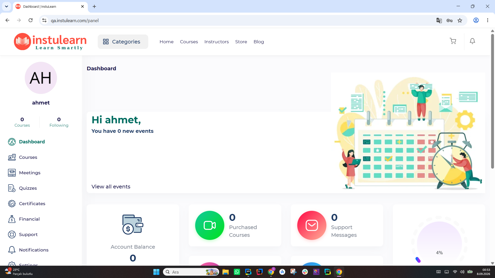
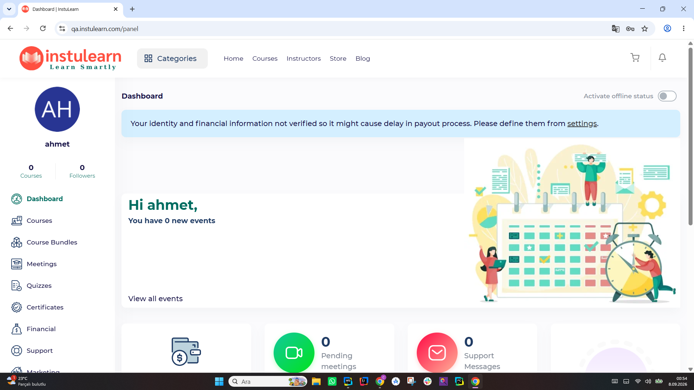
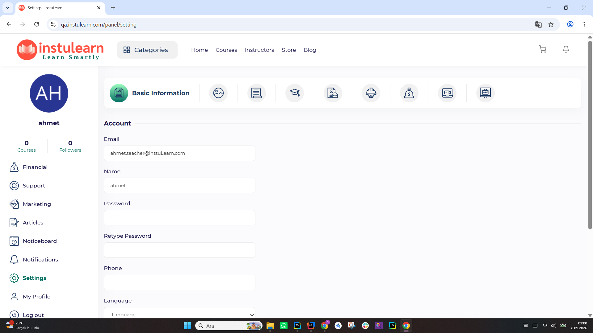
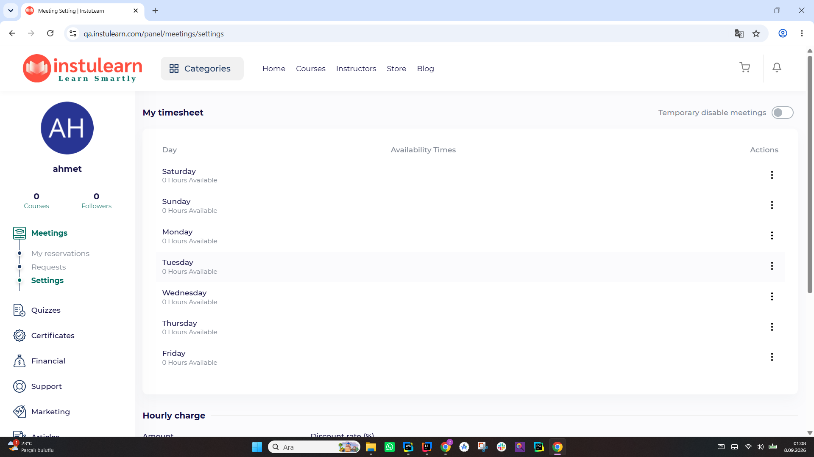
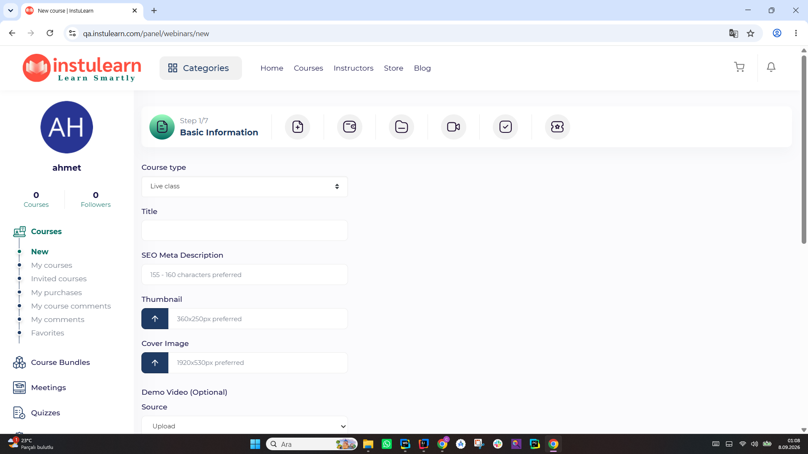

# 🚀 INSTULEARN UI TEST OTOMASYON PROJESİ

> *"Quality at the Speed of Light"* ⚡

**🌐 Test Ortamı:** [https://qa.instulearn.com/](https://qa.instulearn.com/)

<div align="center">

<table>
  <tr>
    <td align="center">
      <br/>
      <sub>Ana Sayfa</sub>
    </td>
    <td align="center">
      <br/>
      <sub>Student Dashboard</sub>
    </td>
    <td align="center">
      <br/>
      <sub>Teacher Dashboard</sub>
    </td>
  </tr>

  <!-- İkinci satır: ileride eklemek istediğiniz ekran görüntüleri -->
  <tr>
    <td align="center">
      <br/>
      <sub>Account Settings</sub>
    </td>
    <td align="center">
      <br/>
      <sub>Create Meetings</sub>
    </td>
    <td align="center">
      <br/>
      <sub>Create New Course</sub>
    </td>
  </tr>
</table>

</div>
---

## 📖 Proje Hakkında

Bu proje, **Instulearn** platformunun kalitesini garanti altına almak için geliştirilmiş, modern teknolojilerle donatılmış bir **UI Test Otomasyon Framework'üdür**.

- **Teknoloji Stack'i:** Selenium WebDriver + Cucumber + Java
- **Yaklaşım:** BDD (Behavior Driven Development)
- **Mimari:** Page Object Model (POM)

---

## 🎯 Hedefler

| Hedef | Açıklama |
| :--- | :--- |
| ✅ **Standartlaşma** | UI test otomasyonunu belirli bir standartta yürütmek |
| ✅ **İş Birliği** | BDD ile teknik ve teknik olmayan ekipler arası iletişim |
| ✅ **CI/CD Entegrasyonu** | Sürekli entegrasyon süreçleriyle tam uyumlu çalışma |
| ✅ **Kapsamlı Raporlama** | Detaylı raporlar ve hata analizleri (Allure/Extent) |
| ✅ **Modülerlik** | Bakımı kolay ve yeniden kullanılabilir kod yapısı |

---


## 🛠️ Teknolojiler ve Araçlar

### 🏗️ Temel Yapı
- **Java:** JDK 21
- **Maven:** Bağımlılık ve Build yönetimi
- **Selenium WebDriver:** Tarayıcı otomasyonu (v4.14.0)
- **Cucumber:** BDD tabanlı test senaryoları (v7.13.0)

### 📊 Raporlama & Loglama
- **Allure Reports:** Gelişmiş görsel raporlar
- **Extent Reports:** Detaylı HTML raporlama
- **Log4j2:** Log yönetimi

### 🧪 Yardımcı Araçlar
- **JUnit 5:** Test koşturucu
- **WebDriver Manager:** Otomatik driver yönetimi
- **Apache POI:** Excel üzerinden veri yönetimi (DDT)
- **ZXing:** QR Kod işlemleri

---

## 📁 Proje Yapısı

```text
com.instuLearnT167/
├── src/
│   ├── main/
│   │   ├── java/
│   │   │   ├── config/          # Konfigürasyon yönetimi (ConfigReader)
│   │   │   ├── drivers/         # Driver yönetimi (DriverManager, BrowserFactory)
│   │   │   ├── pages/           # Page Object Model (POM) sınıfları
│   │   │   └── utils/           # Reusable Methods ve BrowserUtils
│   │   └── resources/           # config.properties ve log4j2.xml
│   │
│   └── test/
│       ├── java/
│       │   ├── features/        # .feature uzantılı Cucumber dosyaları
│       │   ├── runners/         # Testleri başlatan Runner sınıfları
│       │   └── stepdefinitions/ # Feature adımlarının Java karşılıkları
│       └── resources/           # Test dataları (TestData.xlsx)
│
├── reports/                 # Test sonrası oluşturulan raporlar
├── pom.xml                  # Proje bağımlılıkları ve pluginler
└── README.md                # Proje dokümantasyonu
```

---

## ⚙️ Kurulum ve Çalıştırma

### 📋 Gereksinimler

- **Java JDK:** 21+
- **Maven:** 3.9.6+
- **IDE:** IntelliJ IDEA (Önerilen)

### 🚀 Başlangıç

1. **Projeyi Klonlayın:**
   ```bash
   git clone [repository-url]
   cd com.instuLearnT167
   ```

2. **Konfigürasyon:**
    congig.properties.example dosyasindan config.properties olusturum
   `src/main/resources/config.properties` dosyasındaki `url`, `mail` ve `password` alanlarını kontrol edin.

3 **StudentRunner:**
    Sprintte kullancağınız role ile bir runner olusturun

4. **DilSeviyesi:**
    Project Stucters bolumunden SDK  jetBrains RunTime 21.0.8 ayarlamasini yapın
    jdk seviyesi 21

5. **Bağımlılıkları Yükleyin:**
   ```bash
   mvn clean install
   ```

### 🧪 Testleri Çalıştırma

- **Tüm Testler:**
  ```bash
  mvn test
  ```
- **Belirli Tag ile:**
  ```bash
  mvn test -Dcucumber.filter.tags="@login"
  ```
- **Runner Üzerinden:** `src/test/java/runners/TestRunner.java` dosyasına sağ tıklayıp "Run" diyerek başlatabilirsiniz.

---

## 📝 Örnek Kullanım

### Feature Dosyası (`.feature`)
```gherkin
Feature: Login
  Scenario: Successful login with valid credentials
    Given User is on the login page
    When User enters valid email and password
    And User clicks submit button
    Then User should be redirected to home page
```

### Step Definitions (`.java`)
```java
@Given("User is on the login page")
public void user_is_on_login_page() {
    Driver.getDriver().get(ConfigReader.getProperty("url"));
}

@When("User enters valid email and password")
public void user_enters_credentials() {
    loginPage.usernameInput.sendKeys(ConfigReader.getProperty("mail"));
    loginPage.passwordInput.sendKeys(ConfigReader.getProperty("password"));
}
```

---

## 📊 Raporlama

Test sonuçlarını görüntülemek için:

- **Allure Report:**
  ```bash
  mvn allure:serve
  ```
- **Cucumber HTML Report:** `target/cucumber-reports/index.html`

---

## 🤝 Takım İçi Kurallar

- **Branch Stratejisi:** `main` (kararlı) -> `develop` (geliştirme) -> `feature/gorev-adi`
- **Commit Mesajları:** `feat:`, `fix:`, `docs:`, `test:` prefixleri kullanılmalıdır.
- **Code Review:** Her Pull Request en az bir ekip üyesi tarafından incelenmelidir.

---

## 📞 İletişim & Linkler

- **QA Environment:** [qa.instulearn.com](https://qa.instulearn.com)
- **Issues:** Hataları bildirmek için GitHub Issues sekmesini kullanın.

---

## 📜 Lisans

Bu proje **Instulearn Team 167** tarafından geliştirilmektedir. Tüm hakları saklıdır.

⭐ *Başarılı testler dileriz!*
